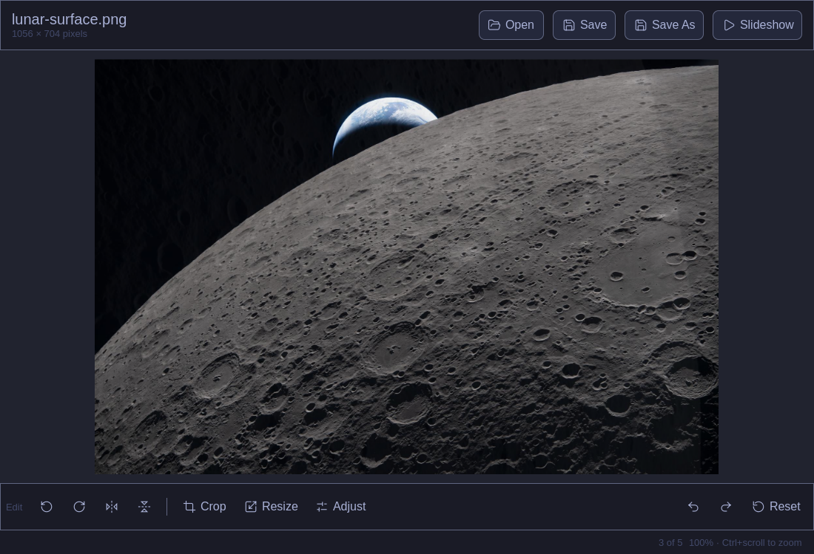

# Talaia

A desktop image viewer with a **Zig** backend (vendored `stb_image` /
`stb_image_write` / `stb_image_resize2`) and a **Qt6/QML** frontend.

Named after the *talaia* — a coastal watchtower built to see the whole
horizon — this is a viewer for looking at your images clearly, including
in fullscreen slideshow.



## Features

- Open any image `stb_image` supports: PNG, JPEG, BMP, GIF (static), TGA,
  PSD, HDR, PIC, PNM/PPM/PGM (no WebP/AVIF/HEIC/SVG)
- Edit tools: rotate, flip, crop, resize, brightness/contrast/saturation
  (live preview, non-destructive until applied), undo/redo, save
- Slideshow over the containing folder, with play/pause, prev/next, and
  fullscreen expand (button, F11, or Escape to exit-then-close)

## Architecture

```
backend/    Zig shared library (C ABI) - decode/encode/transform, no UI
frontend/   Qt6/QML application - UI, folder navigation, slideshow
```

The frontend links directly against the backend's compiled `.so` and talks
to it through the C header in `backend/include/imgbackend.h`. Pixel buffers
are handed to Qt with zero-copy ownership transfer (`QImage` frees them via
a callback into the Zig allocator).

## Prerequisites

- [Zig](https://ziglang.org/) 0.16
- Qt6 (`qt6-base`, `qt6-declarative` — on Arch/Omarchy: `sudo pacman -S qt6-base qt6-declarative`)
- CMake and Ninja (`sudo pacman -S cmake ninja`)
- A C/C++ toolchain (gcc or clang)

## Building

```sh
./build.sh
```

This runs `zig build` in `backend/` to produce `backend/zig-out/lib/libimgbackend.so`,
then configures and builds `frontend/` with CMake/Ninja, producing:

```
frontend/build/image-viewer
```

## Installing

```sh
./install.sh
```

Builds the app, symlinks it as `talaia` into `~/.local/bin`, installs the
app icon into `~/.local/share/icons/hicolor`, and registers a desktop entry
in `~/.local/share/applications` so **Talaia** shows up in your app
launcher. Requires `rsvg-convert` (`sudo pacman -S librsvg`) to rasterize
the icon.

## Running

```sh
talaia [path/to/image]              # after ./install.sh
./frontend/build/image-viewer [path/to/image]   # without installing
```

Passing a path on the command line opens it immediately; otherwise use the
**Open** button in the app.

## Testing

The backend has a unit test covering the open → rotate → save → undo/redo
round trip:

```sh
cd backend && zig build test
```
